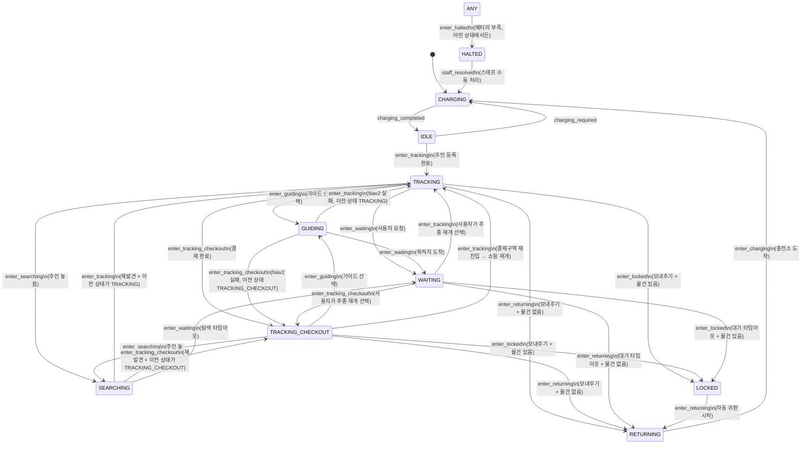

# 로봇 상태 머신 (State Machine)

> **프로젝트:** 쑈삥끼 (ShopPinkki)
> **팀:** 삥끼랩 | 에드인에듀 자율주행 프로젝트 2팀

쑈삥끼의 동작 모드 전환을 State Machine으로 정의합니다.
주행/회피 세부 로직은 별도 Behavior Tree(`docs/behavior_tree.md`)로 분리합니다.

---

## 상태 다이어그램



---

## 상태 정의

| 상태 | 설명 | 결제구역 통과 | 진입 조건 |
|---|---|---|---|
| `CHARGING` | 초기 상태. 충전기 연결 대기 또는 충전 중 | — | 로봇 전원 ON / 충전소 도착 |
| `IDLE` | 사용자 등록 대기. 주인 인형 등록 기능 활성화. LCD에 QR 코드 + 안내 메시지 표시 | — | 충전 완료 (`charging_completed`) |
| `TRACKING` | 주인 인형 팔로워. 장바구니 물건 관리. **결제구역 통과 불가** | ❌ | 주인 등록 완료 / 결제구역 재진입 쇼핑 재개 |
| `TRACKING_CHECKOUT` | TRACKING과 동일한 기능. **결제 완료 후 결제구역 통과 허용** | ✅ | 결제 완료 (`enter_tracking_checkout`) |
| `GUIDING` | 사용자 요청 목적지로 Nav2 이동 안내 | — | 고객 앱에서 가이드 선택 (`enter_guiding`) |
| `SEARCHING` | 주인 놓침. 제자리 회전으로 재탐색 | — | 추종 중 주인 놓침 (`enter_searching`) |
| `WAITING` | 안내 도착·탐색 실패·사용자 요청으로 정지 대기. 사용자가 추종을 재개하거나 타임아웃 시 자동 전환 | — | 안내 도착 / 탐색 타임아웃 / 사용자 대기 요청 (`enter_waiting`) |
| `LOCKED` | 보내주기 요청 + 미결제 물건 있음. 자동으로 충전 스테이션으로 귀환 시작. `is_locked_return = True` 플래그를 유지하며 RETURNING → CHARGING까지 LED 잠금 신호를 표시. 스태프 처리 완료 시 플래그 해제 | — | 보내주기 + 미결제 물건 존재 (`enter_locked`) |
| `RETURNING` | Nav2로 충전 스테이션 복귀 중. `is_locked_return`이 True이면 LED 잠금 신호 유지 | — | 보내주기 + 장바구니 비어있음 / LOCKED 자동 귀환 |
| `HALTED` | 배터리 부족으로 그 자리에서 즉시 정지. 자동 전환 없음. 스태프 수동 처리까지 유지 | — | 배터리 부족 (`enter_halted`) |

> **TRACKING vs TRACKING_CHECKOUT 차이:**
> - 결제 관련 동작을 제외하면 두 상태는 동일한 기능(팔로워, 장바구니 관리, 가이드, 탐색)을 수행한다.
> - `TRACKING`: 결제구역 경계를 넘어 출구 방향으로 이동 불가. 결제구역 진입 시 앱 결제 팝업 + LCD 결제 안내 메시지 표시.
> - `TRACKING_CHECKOUT`: 결제 완료 상태. 출구 방향 이동 가능. 결제구역 안쪽으로 재진입 시 `TRACKING`으로 전환.

> **WAITING vs HALTED 차이:**
> - `WAITING`: 탐색 실패 후 일시 정지. 사용자가 앱으로 추종을 재개하거나, 타임아웃 시 장바구니 상태에 따라 자동 전환.
> - `HALTED`: 배터리 부족으로 즉시 정지. 자동 전환 없음. 스태프가 직접 와서 수동으로 해결할 때까지 유지.

---

## 전환 정의

### 기본 흐름

| From | To | 트리거 | 조건 |
|---|---|---|---|
| `[*]` | `CHARGING` | — | 로봇 전원 ON (초기 상태) |
| `CHARGING` | `IDLE` | `charging_completed` | 충전 완료 |
| `IDLE` | `CHARGING` | `charging_required` | 배터리 부족 감지 |
| `IDLE` | `TRACKING` | `enter_tracking` | 주인 인형 등록 완료 |
| `RETURNING` | `CHARGING` | `enter_charging` | 충전 스테이션 도착 |
| `HALTED` | `CHARGING` | `staff_resolved` | 스태프가 로봇을 충전 스테이션으로 이동 후 수동 초기화 |

### 전역 전환 (모든 상태에서 가능)

| From | To | 트리거 | 조건 |
|---|---|---|---|
| `*` (모든 상태) | `HALTED` | `enter_halted` | 배터리 부족 감지 → 즉시 그 자리에서 정지, 스태프 대기 |

> `transitions` 라이브러리에서 `source='*'`로 선언하여 어떤 상태에서든 배터리 부족 시 HALTED로 전환된다.

### TRACKING / TRACKING_CHECKOUT 공통 전환

| From | To | 트리거 | 조건 |
|---|---|---|---|
| `TRACKING` / `TRACKING_CHECKOUT` | `GUIDING` | `enter_guiding` | 고객이 앱에서 가이드(길 안내) 선택 |
| `TRACKING` / `TRACKING_CHECKOUT` | `SEARCHING` | `enter_searching` | 보행자 추종 불가 또는 주인 놓침 |

### TRACKING 전용 전환

| From | To | 트리거 | 조건 |
|---|---|---|---|
| `TRACKING` | `TRACKING_CHECKOUT` | `enter_tracking_checkout` | 결제구역에서 결제 완료 |
| `TRACKING` | `WAITING` | `enter_waiting` | 사용자가 앱에서 [대기하기] 선택 |
| `TRACKING` | `LOCKED` | `enter_locked` | "보내주기" 요청 + 미결제 물건 있음 |
| `TRACKING` | `RETURNING` | `enter_returning` | "보내주기" 요청 + 장바구니 비어있음 |

> 결제구역 **진입** 시 SM 상태 변경 없음 (TRACKING 유지). 앱에 결제 팝업 + LCD 결제 안내 메시지 표시. 결제 완료 후 `enter_tracking_checkout` 전환.

### TRACKING_CHECKOUT 전용 전환

| From | To | 트리거 | 조건 |
|---|---|---|---|
| `TRACKING_CHECKOUT` | `TRACKING` | `enter_tracking` | 결제구역 안쪽으로 재진입 → 미결제 물건 추가 쇼핑 재개 |
| `TRACKING_CHECKOUT` | `LOCKED` | `enter_locked` | "보내주기" 요청 + 미결제 물건 있음 |
| `TRACKING_CHECKOUT` | `RETURNING` | `enter_returning` | "보내주기" 요청 + 장바구니 비어있음 |

### GUIDING 전환

| From | To | 트리거 | 조건 |
|---|---|---|---|
| `GUIDING` | `WAITING` | `enter_waiting` | Nav2 목적지 도착 성공 (BT4 SUCCESS). 앱에 `arrived` 이벤트 전송 |
| `GUIDING` | `TRACKING` | `enter_tracking` | Nav2 실패 (`sm.resume_tracking()`). 직전 상태가 TRACKING |
| `GUIDING` | `TRACKING_CHECKOUT` | `enter_tracking_checkout` | Nav2 실패 (`sm.resume_tracking()`). 직전 상태가 TRACKING_CHECKOUT |

### SEARCHING 전환

| From | To | 트리거 | 조건 |
|---|---|---|---|
| `SEARCHING` | `TRACKING` | `enter_tracking` | 주인 재발견. 직전 상태가 TRACKING |
| `SEARCHING` | `TRACKING_CHECKOUT` | `enter_tracking_checkout` | 주인 재발견. 직전 상태가 TRACKING_CHECKOUT |
| `SEARCHING` | `WAITING` | `enter_waiting` | 탐색 타임아웃 |

### WAITING 전환

| From | To | 트리거 | 조건 |
|---|---|---|---|
| `WAITING` | `TRACKING` | `enter_tracking` | 고객이 앱에서 추종 재개 선택. 직전 상태가 TRACKING |
| `WAITING` | `TRACKING_CHECKOUT` | `enter_tracking_checkout` | 고객이 앱에서 추종 재개 선택. 직전 상태가 TRACKING_CHECKOUT |
| `WAITING` | `LOCKED` | `enter_locked` | 대기 타임아웃 + 장바구니에 물건 있음 |
| `WAITING` | `RETURNING` | `enter_returning` | 대기 타임아웃 + 장바구니 비어있음 |

### LOCKED / RETURNING / HALTED 전환

| From | To | 트리거 | 조건 |
|---|---|---|---|
| `LOCKED` | `RETURNING` | `enter_returning` | LOCKED 진입 즉시 자동 귀환 시작 |
| `HALTED` | `CHARGING` | `staff_resolved` | 스태프 수동 처리 완료 |

---

## 구현 노트

### 라이브러리
- **`transitions`** — Python 상태 머신 라이브러리. `on_enter_*` / `on_exit_*` 콜백으로 ROS 2 퍼블리셔·서비스 호출 연결.

### 직전 상태 추적 (previous_tracking_state)

`GUIDING`, `SEARCHING`, `WAITING` 복귀 시 `TRACKING` 또는 `TRACKING_CHECKOUT` 중 어디로 돌아갈지 판단하기 위해 SM 인스턴스에 `previous_tracking_state` 변수를 유지한다.

### 잠금 귀환 플래그 (is_locked_return)

`LOCKED → RETURNING → CHARGING` 경로로 귀환 시, 상태가 바뀌어도 LED가 잠금 신호를 유지하기 위해 `is_locked_return` 플래그를 사용한다. LED 색 결정은 상태가 아닌 이 플래그를 우선 확인한다.

```python
class ShoppinkkiFSM:
    def __init__(self):
        self.previous_tracking_state = 'TRACKING'
        self.is_locked_return = False

    def on_enter_GUIDING(self):
        self.previous_tracking_state = self.state  # TRACKING or TRACKING_CHECKOUT

    def on_enter_SEARCHING(self):
        self.previous_tracking_state = self.state

    def on_enter_WAITING(self):
        self.previous_tracking_state = self.state

    def on_enter_LOCKED(self):
        self.is_locked_return = True   # RETURNING → CHARGING까지 LED 잠금 신호 유지

    def on_enter_CHARGING(self):
        # is_locked_return은 스태프가 staff_resolved를 호출할 때까지 유지
        pass

    def on_staff_resolved(self):
        self.is_locked_return = False  # 스태프 처리 완료 → 정상 충전 LED로 복귀
        terminate_session()            # SESSION.is_active=0, ROBOT.active_user_id=NULL

    def get_led_color(self):
        if self.is_locked_return:
            return LED_LOCKED          # 상태 무관, 잠금 신호 우선
        return LED_BY_STATE[self.state]

    def resume_tracking(self):
        """GUIDING / SEARCHING / WAITING 복귀 시 호출"""
        if self.previous_tracking_state == 'TRACKING_CHECKOUT':
            self.trigger('enter_tracking_checkout')
        else:
            self.trigger('enter_tracking')
```

### 구조
```
ShoppinkkiStateMachine (transitions.Machine)
├── states: [CHARGING, IDLE, TRACKING, TRACKING_CHECKOUT,
│            GUIDING, SEARCHING, WAITING, LOCKED, RETURNING, HALTED]
├── initial: CHARGING
├── previous_tracking_state: str   ← TRACKING / TRACKING_CHECKOUT 복귀 판단용
└── is_locked_return: bool         ← LOCKED 귀환 중 LED 잠금 신호 유지용
```

### ROS 토픽 연동

| 항목 | 방식 |
|---|---|
| 현재 상태 발행 | `on_enter_*` 콜백 → `/robot_<id>/status` 루프(1~2Hz) |
| 앱 모드 전환 명령 수신 | `/robot_<id>/cmd` 구독 콜백 → JSON 파싱 후 `sm.trigger(...)` 호출 |
| 결제구역 진입 감지 | BoundaryMonitor → 앱 결제 팝업 전송 + LCD 결제 안내 메시지 전환 (SM 상태 변경 없음) |
| 결제구역 출구 차단 | BoundaryMonitor → `state == TRACKING`이면 이동 차단 |
| 결제구역 재진입 감지 | BoundaryMonitor → `state == TRACKING_CHECKOUT`이면 `sm.trigger('enter_tracking')` |
| 결제 완료 수신 | `/robot_<id>/cmd`: `{"cmd": "payment_success"}` → `sm.trigger('enter_tracking_checkout')` |
| 배터리 부족 감지 | pinkylib polling → 임계값 이하 시 `sm.trigger('enter_halted')` → **어떤 상태에서든** 즉시 그 자리 정지 (`source='*'`로 전역 등록) |
| LOCKED 진입 시 자동 귀환 | `on_enter_LOCKED` 콜백 → `is_locked_return = True` 설정 + Nav2 충전 스테이션 Goal 전송 |
| LOCKED 충전소 도착 | Nav2 Goal 성공 → `sm.trigger('enter_returning')` → 이후 `sm.trigger('enter_charging')`. `is_locked_return`은 유지되므로 LED 잠금 신호 계속 표시 |
| 스태프 수동 초기화 | 관제 UI 또는 물리 버튼 → `sm.on_staff_resolved()` → `is_locked_return = False` + `sm.trigger('charging_completed')` |
| 충전소 도착 감지 | Nav2 Goal 성공 (RETURNING 상태) → `sm.trigger('enter_charging')` |
