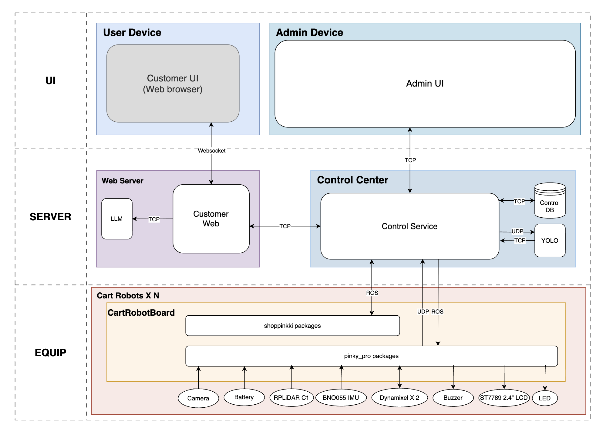

# 시스템 아키텍처 (System Architecture)

> **프로젝트:** 쑈삥끼 (ShopPinkki)

---

## 전체 구성



---

## 레이어 구조

시스템은 세 개의 물리적 레이어로 구성된다.

```
┌──────────────────────────────────────────────────────────┐
│  UI                                                      │
│  ┌─────────────────┐        ┌─────────────────┐          │
│  │   User Device   │        │  Admin Device   │          │
│  │  (Customer UI)  │        │   (Admin UI)    │          │
│  └─────────────────┘        └─────────────────┘          │
└──────────────────────────────────────────────────────────┘
┌──────────────────────────────────────────────────────────┐
│  SERVER                                                  │
│  ┌───────────────┐  ┌─────────────┐  ┌────────────────┐ │
│  │  Mini Server  │  │  AI Server  │  │ Control Center │ │
│  │ Customer Web  │  │ YOLO / LLM  │  │ Control Device │ │
│  └───────────────┘  └─────────────┘  └────────────────┘ │
└──────────────────────────────────────────────────────────┘
┌──────────────────────────────────────────────────────────┐
│  EQUIP                                                   │
│  ┌──────────────────────────────────────────────────┐    │
│  │  Cart Module × N  (카트 로봇)                    │    │
│  │  [Robot] [Robot] [Robot] ...                     │    │
│  └──────────────────────────────────────────────────┘    │
└──────────────────────────────────────────────────────────┘
```

---

## 컴포넌트 목록

### UI 레이어

| 컴포넌트 | 실행 위치 | 역할 |
|---|---|---|
| `Customer UI` | User Device (스마트폰 브라우저) | 고객용 웹앱. 상품 검색, 장바구니, 결제, 로봇 상태 확인 |
| `Admin UI` | Admin Device (관제 PC) | 관리자용 관제 앱. 로봇 모니터링, 알람 처리, 강제 명령 |

### SERVER 레이어

| 컴포넌트 | 실행 위치 | 역할 |
|---|---|---|
| `Customer Web` | Mini Server (서버 PC) | Flask + SocketIO. 고객 UI 서빙 및 control_service 중계. LLM 직접 호출 |
| `AI Server` | 서버 PC (Docker) | YOLOv8 추론 서버 (TCP :5005) + LLM 자연어 검색 서버 (REST :8000) |
| `Control Device` | Control Center (서버 PC) | ROS2 노드 + TCP 서버 (:8080) + REST API. 로봇 명령·상태 관리. Control DB 전담 |
| `Control DB` | Control Center (서버 PC) | PostgreSQL 17. SESSION / CART / ROBOT / ZONE / BOUNDARY_CONFIG 등 전체 테이블 중앙 통합 |
| `Open-RMF Fleet Adapter` | 서버 PC | RMF Traffic Schedule + Fleet Adapter. 다중 로봇 경로 충돌 자동 협상. Control Device 위에 레이어로 삽입 — Pi 코드 변경 없음 |

### EQUIP 레이어

| 컴포넌트 | 실행 위치 | 역할 |
|---|---|---|
| `shoppinkki_core` | Pi 5 (카트 로봇) | SM + BT 통합 노드. HW 제어 (LED, LCD, 부저) |
| `shoppinkki_perception` | Pi 5 | 커스텀 YOLO 인형 감지 / QR 스캔 |
| `shoppinkki_nav` | Pi 5 | Nav2 BT (Guiding / Returning / Waiting 회피) + BoundaryMonitor |
| `pinky_pro packages` | Pi 5 | 모터 드라이버, 오도메트리, TF, LiDAR, 카메라 원시 데이터 |
| `Nav2 스택` | Pi 5 | AMCL 위치 추정, 경로 계획 |

---

## 통신 채널

| 채널 | 연결 | 프로토콜 | 방향 | 설계 이유 |
|---|---|---|---|---|
| A | Customer UI ↔ Customer Web | WebSocket (SocketIO) | 양방향 | 로봇 상태·위치를 새로고침 없이 실시간 Push |
| B | Admin UI ↔ Control Device | TCP | 양방향 | 관리자 명령 유실 불허 → 신뢰성 최우선 |
| C | Customer Web ↔ Control Device | TCP (localhost:8080, JSON 개행 구분) | 양방향 | 고객 요청을 control_service로 중계 |
| D | Customer Web ↔ AI Server (LLM) | REST HTTP (:8000) | 양방향 | 자연어 상품 검색을 customer_web이 직접 처리 |
| E | Control Device ↔ Control DB | TCP | 양방향 | DB가 Control Center 내 독립 서비스로 분리 |
| F | Control Device ↔ AI Server (YOLO) | TCP + UDP 하이브리드 | 양방향 | 영상(무거움) → UDP / 인식 결과(좌표) → TCP |
| G | Control Device ↔ shoppinkki packages | ROS 2 DDS (`ROS_DOMAIN_ID=14`) | 양방향 | 비즈니스 로직 명령·상태 발행/구독. Open-RMF 사용 시 `navigate_to`는 RMF FleetAdapter가 Control Device REST API를 경유해 전달하며, `task_dispatcher ↔ RMF Traffic Schedule ↔ FleetAdapter` 구간은 RMF 내부 DDS 통신 (채널 G 범위 외) |
| H | Control Device ↔ pinky_pro packages | ROS 2 + UDP | 양방향 | 주행 명령 → ROS / 원시 카메라·센서 데이터 → UDP |

> 각 채널의 메시지 포맷 상세: [`docs/interface_specification.md`](interface_specification.md)

---

## 데모 모드

> 로봇이 작아 실제 맵에서 사람을 직접 인식하기 어렵기 때문에, **특정 인형을 대상으로 커스텀 학습된 YOLOv8 모델**로 추종한다.

| 항목 | 내용 |
|---|---|
| **로봇 위치** | 마트 바닥 (실제 맵 위에서 주행) |
| **추종 대상** | 전용 인형 (custom-trained YOLOv8) |
| **추종 방식** | 커스텀 YOLO 감지 결과 → P-Control (bbox 중심·크기 기반) |
| **ReID / 색상 매칭** | ✅ IDLE 시 인형 ReID 특징 벡터 + 색상 히스토그램 등록. TRACKING 시 YOLO 감지 후 ReID+색상으로 주인 인형 식별 |
| **Nav2 / AMCL / 맵** | ✅ (GUIDING / RETURNING / WAITING 회피에 사용) |
| **결제 구역 / 경계 감시** | ✅ (BoundaryMonitor via AMCL pose) |
